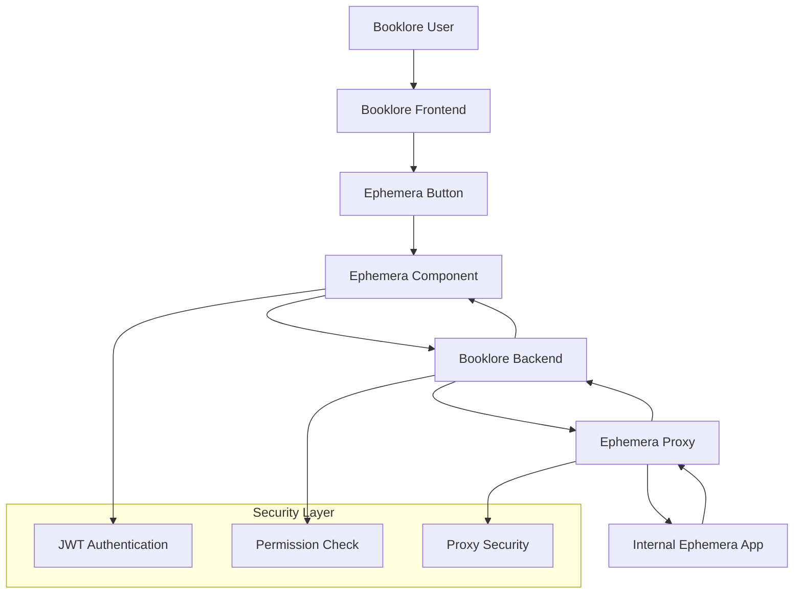

# Ephemera Proxy Integration

## Overview

The Ephemera proxy integration enables Booklore users to securely access the internal Ephemera book processing application through Booklore's authentication system. This solution provides transparent forwarding of HTTP requests from Booklore to the internal Ephemera instance while maintaining security and access controls.

## Architecture

### System Flow



### Components

#### Backend Components

1. **EphemeraProxyService** (`booklore-api/src/main/java/com/adityachandel/booklore/service/ephemera/EphemeraProxyService.java`)
   - HTTP proxy service for forwarding requests to Ephemera
   - Handles request/response transformation
   - Configurable timeout and error handling

2. **EphemeraController** (`booklore-api/src/main/java/com/adityachandel/booklore/controller/EphemeraController.java`)
   - Catch-all endpoint at `/api/ephemera/**`
   - Requires `canManipulateLibrary` or `admin` permissions
   - Uses standard JWT authentication

3. **EphemeraProperties** (`booklore-api/src/main/java/com/adityachandel/booklore/service/ephemera/EphemeraProperties.java`)
   - Configuration properties for Ephemera integration
   - Base URL and timeout settings

#### Frontend Components

1. **EphemeraComponent** (`booklore-ui/src/app/features/ephemera/ephemera.component.ts`)
   - Iframe-based component for displaying Ephemera interface
   - Loading and error states
   - Routes to `/ephemera`

2. **Topbar Integration** (`booklore-ui/src/app/shared/layout/component/layout-topbar/`)
   - Ephemera button in desktop and mobile views
   - Same permission structure as bookdrop

3. **Routing** (`booklore-ui/src/app/app.routes.ts`)
   - Protected route with `ManageLibraryGuard`

## Configuration

### Backend Configuration

Add to `application.yaml`:

```yaml
app:
  ephemera:
    base-url: "http://10.129.20.50:8286"  # Internal Ephemera URL
    timeout-ms: 30000                     # Request timeout in milliseconds
```

### Environment Variables

The Ephemera base URL can be overridden with environment variables:

```bash
export EPHEMERA_BASE_URL="http://10.129.20.50:8286"
export EPHEMERA_TIMEOUT_MS=30000
```

## Security

### Authentication
- Uses existing Booklore JWT/OIDC authentication
- No changes to authentication flow required

### Authorization
- Requires `canManipulateLibrary` or `admin` permissions
- Same permission model as bookdrop functionality
- Managed by `ManageLibraryGuard` on frontend
- Enforced by `@PreAuthorize` on backend

### Network Security
- Ephemera remains internal-only (not exposed to public internet)
- All requests go through Booklore proxy
- No direct external access to Ephemera

## Usage

### Accessing Ephemera

1. **Login to Booklore** with appropriate permissions
2. **Click Ephemera button** in top navigation bar (book icon)
3. **Use Ephemera interface** displayed within Booklore

### URL Structure

- Booklore Ephemera route: `/ephemera`
- Proxy endpoint: `/api/ephemera/**`
- Internal Ephemera: `http://10.129.20.50:8286/**`

## Testing

### Backend Testing

```bash
# Test proxy connectivity
curl -H "Authorization: Bearer <jwt-token>" \
  http://localhost:8080/api/ephemera/

# Test with specific Ephemera endpoint
curl -H "Authorization: Bearer <jwt-token>" \
  http://localhost:8080/api/ephemera/api/some-endpoint
```

### Frontend Testing

1. **Login** as user with library management permissions
2. **Navigate** to Ephemera via topbar button
3. **Verify** Ephemera interface loads in iframe
4. **Test** functionality through proxy

### Error Scenarios

- **Ephemera unavailable**: Shows error state in component
- **Permission denied**: Redirects to dashboard
- **Network timeout**: Returns 500 error after configured timeout

## Monitoring

### Logging

The proxy service logs:
- Request URLs being proxied
- Response status codes
- Error conditions and timeouts

### Metrics

Monitor for:
- Proxy request count and duration
- Error rates
- Ephemera availability

## Troubleshooting

### Common Issues

1. **Ephemera not loading**
   - Check Ephemera service availability
   - Verify network connectivity to internal address
   - Check proxy logs for errors

2. **Permission denied**
   - Verify user has `canManipulateLibrary` or `admin` permissions
   - Check JWT token validity

3. **Timeout errors**
   - Adjust `timeout-ms` configuration if needed
   - Check Ephemera response times

### Debug Mode

Enable debug logging for proxy:

```yaml
logging:
  level:
    com.adityachandel.booklore.service.ephemera: DEBUG
```

## Deployment

### Bare Metal Deployment

Since this is deployed on Proxmox containers:

1. **Build** the updated Booklore application
2. **Deploy** to production container
3. **Verify** Ephemera connectivity from container
4. **Test** end-to-end functionality

### Configuration Updates

The Ephemera base URL is configurable and can be updated without code changes by modifying the `application.yaml` or environment variables.

## Maintenance

### Updates

- Ephemera URL changes: Update `app.ephemera.base-url`
- Timeout adjustments: Modify `app.ephemera.timeout-ms`
- Security changes: Follow standard Booklore security practices

### Monitoring

Regularly monitor:
- Proxy success/failure rates
- Response times
- Ephemera service availability